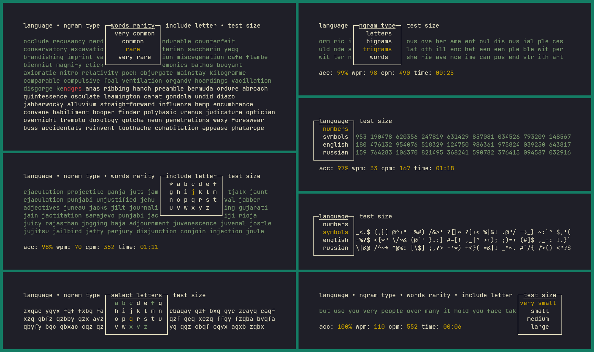

## About

Standalone typing test app.<br>
The idea was to combine features I found useful from [Typing Practice (keybr.com)](https://www.keybr.com/), [Monkeytype](https://monkeytype.com/), [KeyPresso](https://keypresso.ru/), [Ngram Type](https://ranelpadon.github.io/ngram-type/) and exclude ads, personal data collection and server instabilities

## Features

- Words of different rarity (english 200, english 1k, etc)
- Filter words to include specific letter (to train rare letters like "J" or "Q", or to test how letter swaps in keyboard layout feel)
- Bigrams and Trigrams
- Learn letters one by one in your own order and pace (useful for learning touch-typing or new keyboard layouts)
- Numbers mode
- Symbols mode
- WPM/CPM, time and accuracy meters after each test
- different test sizes: from one line up to twelve

## Adding More Languages

Currently supported languages:<br>

- Numbers
- Symbols
- English
- Russian

Numbers and Symbols languages are hardcoded, others can be added relatively easily by modifying `data/languages.json` and providing according data.<br>

## Build

Requires [Rust toolchain](https://rust-lang.org/tools/install/)<br>

```rs
cargo run --bin serializer --release && cargo build --bin drochetype --release
```

1. Runs serializer to convert jsons with language data into single compressed binary blob<br>
2. Builds Drochetype app itself<br>
3. Result will be inside ./target/release directory<br>

## Copywrite

Drochetype<br>
Copyright (C) 2025-2026 Edward Starkov <https://github.com/7Bpencil><br>
Released under the GNU General Public License version 3:<br>

    This program is free software: you can redistribute it and/or modify
    it under the terms of the GNU General Public License as published by
    the Free Software Foundation, either version 3 of the License, or
    (at your option) any later version.

    This program is distributed in the hope that it will be useful,
    but WITHOUT ANY WARRANTY; without even the implied warranty of
    MERCHANTABILITY or FITNESS FOR A PARTICULAR PURPOSE. See the
    GNU General Public License for more details.

    You should have received a copy of the GNU General Public License
    along with this program. If not, see <https://www.gnu.org/licenses/>.

---------------------------------------------------------------

data/english.json<br>
data/english_1k.json<br>
data/english_25k.json<br>
data/english_450k.json<br>
data/russian.json<br>
data/russian_1k.json<br>
data/russian_25k.json<br>
data/russian_375k.json<br>

Copywrite (C) <https://github.com/monkeytypegame><br>
Released under the GNU General Public License version 3.
